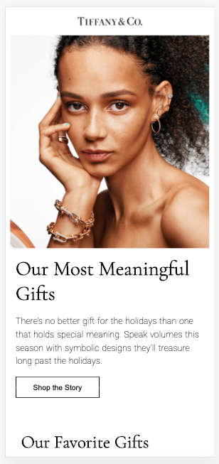
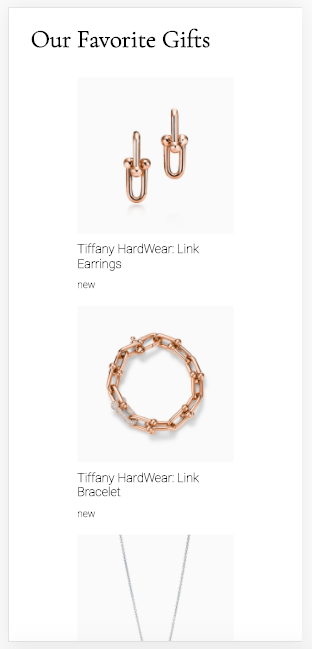
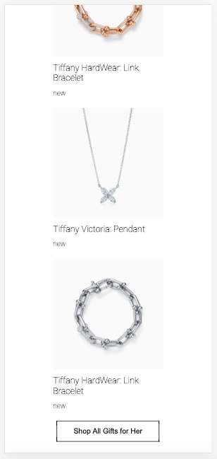
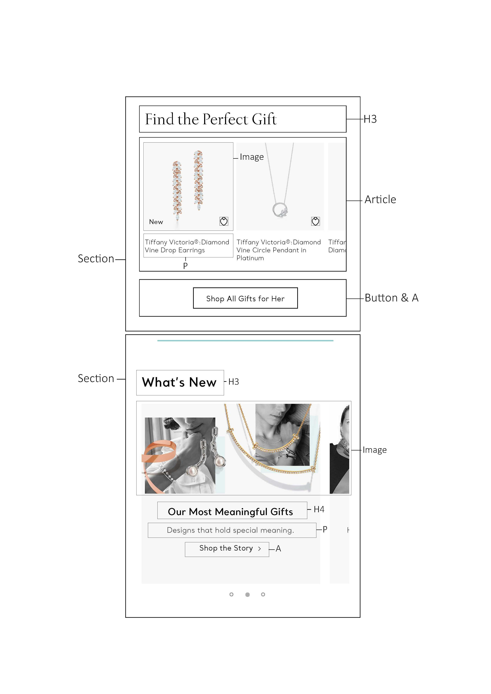
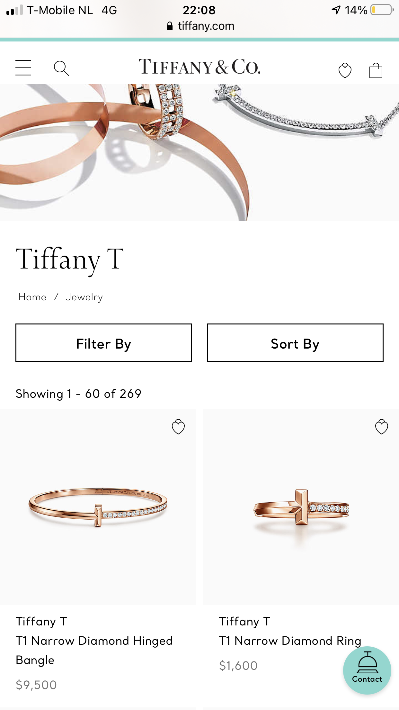

# Procesverslag
**Auteur:** Jenny Matthijsen (500833866)

Markdown cheat cheet: [Hulp bij het schrijven van Markdown](https://github.com/adam-p/markdown-here/wiki/Markdown-Cheatsheet). Nb. de standaardstructuur en de spartaanse opmaak zijn helemaal prima. Het gaat om de inhoud van je procesverslag. Besteedt de tijd voor pracht en praal aan je website.

## Bronnenlijst afbeelding website
1. https://www.tiffany.com/
2. x
3. x

## Bronnenlijst
1. https://www.w3schools.com/css/css3_buttons.asp
2. x
3. x

## Eindgesprek (week 7/8)

-dit ging goed & dit was lastig-

**Screenshot(s):**

-screenshot(s) van je eindresultaat-

## Voortgang 3 (week 6)

-same as voortgang 1-

## Voortgang 2 (week 5)

-same as voortgang 1-

## Voortgang 1 (week 3)

### Stand van zaken

Dit ging goed:
Ik kon de content (tekst en afbeeldingen) makkelijk van de website van Tiffany & Co afhalen. Hier was ik dus snel mee klaar en kon ik beginnen aan de website zelf. 
Ik heb voor nu alle elementen onder elkaar gezet en dit ging goed. 
Ik heb ze zo veel mogelijk proberen te stylen naar hoe de officiële website eruit ziet. Dit is al aardig gelukt.

Dit was lastig:
De website van Tiffany & Co is moeilijk gebouwd en daarom kon ik weinig aflezen van hoe zij het hebben gedaan.
Bij inspecteren kon ik bijvoorbeeld niet vinden hoe zij bepaalde elementen hebben gestyled. 

Ik heb geprobeerd de blauw-groene balk die bovenaan de website en een paar keer tussendoor staat na te maken. Ik kon op internet niet goed vinden hoe dit moest en het lukte mij ook niet door verschillende dingen te proberen.

Verder heb ik een aantal elementen proberen te stylen met position, maar dit lukte nog niet.

**Screenshot(s):**

Homepagina mobiel:
 
Dit is de homepagina. Zo ziet de site eruit als je deze opent.
Je ziet een afbeelding, titel, stukje tekst en een knop. Deze knop brengt je naar een andere pagina met de sieraden.

 
Als je verder naar beneden scrollt zie je al een aantal producten onder het kopje 'Our Favorite Gifts'.
Hier staat de naam bij en 'new'. Dit moet nog links onderin over de afbeelding heen geplaatst worden.

 
Hier zie je de rest van de producten en een knop. Deze brengt je naar een pagina met 'All Gifts For Her'.
De producten staan op de website van Tiffany & Co in een slider. Ik heb online opgezocht hoe dit moet, maar dit vond ik ingewikkeld.
Hier wil ik later nog naar kijken.

### Agenda voor meeting

Student 1: Daniel
- 

Student 2: Luca
-

Student 3: Jenny
	- Hoe moet je een slider maken?
	- Hoe moet ik de blauwe lijnen die je tussendoor ziet maken?
	- Position werkt nog niet, wat doe ik fout?
	- Iconen in nav -> hoe moet ik deze vormgeven en laten werken?

### Verslag van meeting

-na afloop snel uitkomsten vastleggen-

## Breakdownschets (week 1)

## Intake (week 1)

**Je startniveau:** Mijn niveau zit tussen blauw en rood: ik kan redelijk goed omgaan met code, maar dan moet ik het wel regelmatig herhalen. Ik kan ook nog niet hele uitdagende websites maken. 

**Je focus:** Ik wil graag op allebei de opties focussen. Maar als dit teveel of te moelijk blijkt te zijn, wil ik verder gaan met surface plane.

**Je opdracht:** Ik kies ervoor om een bestaande website na te maken. Namelijk de website van Tiffany & Co https://www.tiffany.com/ 

**Screenshot(s) van de eerste pagina (small screen):**

**Screenshot(s) van de tweede pagina (small screen):**

