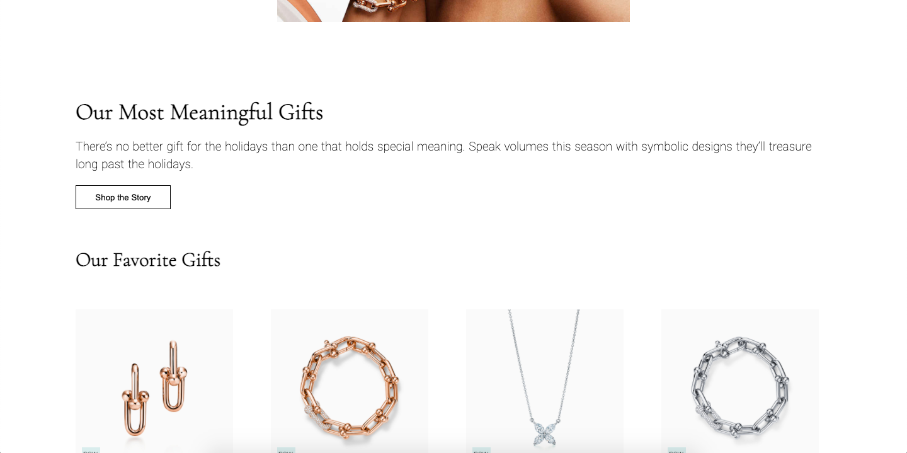
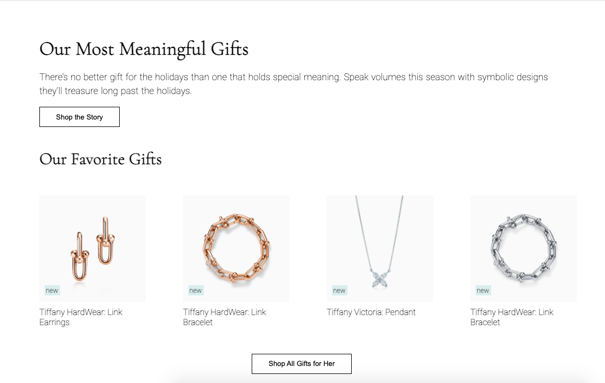
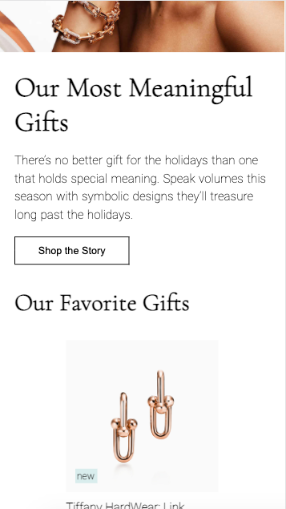
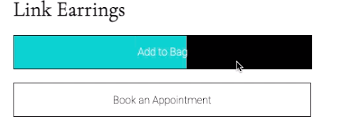

# Procesverslag
**Auteur:** Jenny Matthijsen (500833866)

Markdown cheat cheet: [Hulp bij het schrijven van Markdown](https://github.com/adam-p/markdown-here/wiki/Markdown-Cheatsheet). Nb. de standaardstructuur en de spartaanse opmaak zijn helemaal prima. Het gaat om de inhoud van je procesverslag. Besteedt de tijd voor pracht en praal aan je website.

## Bronnenlijst afbeelding website
Alle afbeeldingen op mijn website zijn afkomstig van de officiële Tiffany & Co website: 
https://www.tiffany.com/

## Bronnenlijst code website
1. https://www.w3schools.com/css/css3_buttons.asp Button
2. https://codepen.io/jennymatthijsen/pen/zYKrYyw Hamburgermenu
3. https://codepen.io/jennymatthijsen/pen/PoGGOwz?editors=1100 Hamburgermenu
4. https://www.youtube.com/watch?v=kEf1xSwX5D8&ab_channel=DaniKrossing Favicon
5. https://www.canva.com/colors/color-meanings/tiffany-blue/ Tiffany & Co blue colour HEX code
6. https://dev.to/webdeasy/top-20-css-buttons-animations-f41 Animatie
7. https://fonts.google.com/specimen/Roboto font Roboto
8. https://fonts.google.com/specimen/Cormorant+Garamond font Cormorant Garamond

## Toegankelijkheidstest 

Ik heb door middel van een schreenreader de toegankelijkheid van mijn website getest.
Hieruit kwam het volgende:
Als je naar de browser gaat, leest de Voiceover de naam van de website op en op welk tabblat je je bevindt.
Vervlolgens kun je door de website dmv tab. 

Ik ben begonnen met kijken hoe het menu werkt met de Voiceover. Door op enter de drukken opent het hamburgermenu. 
De Voiceover zegt dan: menu, knop, navigatie. 
Door tab te gebruiken kun je dan door de verschillende opties. Het kruisje is een link en leest de Voiceover ook op als link. De rest heb ik geen pagina's voor aangemaakt en leest de Voiceover daarom als tekstvak.

Als je verder naar beneden tabt gebeurt er iets geks. Het hamburgermenu gaat door de afbeeldingen op de pagina heen.

 

Op de afbeelding zie je hoe het door elkaar heen loopt.

Als je het hamburgermenu weer sluit, kun je door de pagina heen tabben. De Voiceover leest dan op wat er staan: h1 met de tekst erin. Button met de tekst erin. Afbeelding met de alt tekst. 

Door op de bovenste afbeelding enter te drukken kom je op de tweede pagina. Ook hier kun je door de pagina tabben en leest de Voiceover de elementen voor. 

Dit ga ik daarom nog aanpassen:
Ik ga nog onderzoeken hoe het kan dat het hamburgermenu door de pagina heen gaat en als ik vind hoe dit kan ga ik dit ook proberen te verbeteren.

## Eindgesprek (week 7/8)

Dit ging goed:
Ik wilde nog een aantal kleine dingen toevoegen, zoals een animatie wanneer je op de button klikt. 
Ook klopte de position van de h4: 'new' nog niet. Hij stond niet op de goede plek en mijn website was nog niet responsive.

Aan deze dingen hebben ik de laatste weken gewerkt.
De animatie is helemaal gelukt met behulp van een website die hier uitleg over gaf. 
Ook de media queries lukte goed. Deze heb ik (bijna) volledig zelf kunnen doen. Zo heb ik 3 breakpoints bepaald waardoor de website er op verschillende formaten goed uit ziet.

Nadat Jimmy Dekker (ook uit klas 202) heeft geholpen met een paar dingen die niet lukte. Heb ik de website zonder moeilijkheden af kunnen maken.

Dit was lastig:
Bij de mediaqueries lukte het niet om de afbeeldingen naast elkaar te krijgen. Dit bleek omdat ik niet op de parent de display: flex had gezet, maar op een ander element. Hier liep ik dus vast.
Nadat Jimmy dit had uitgelegd heb ik dit verbeterd en werkte het wel.

Ook heeft hij geholpen om de position op de goede plek te krijgen. 
En heeft hij nog een aantal kleine foutjes uit mijn code gehaald. Zo was ik bij de article tag in de index, het element vergeten te sluiten.
Hierdoor moest ik wel nog de css aanpassen, want de marges klopte niet meer overal.

Nadat ik dit allemaal had opgeslot kon ik mijn website helemaal afmaken tot het punt waarop ik besloot dat ik het zo goed als mogelijk vond.

**Screenshot(s):**

 
Pagina op groot scherm. Dit is Google op mijn laptop over de volledige breedte geopend.

 
Pagina op middel groot scherm. Dit is Google op mijn laptop over de helft geopend.

 
Pagina op telefoon formaat: iPhone 6/7/8

 
Animatie wanneer je op de button 'add to bag' klikt

## Voortgang 3 (week 6)

### Stand van zaken

Dit ging goed:
Na afloop van voortgang 2 heb ik goed verder kunnen werken aan de opdracht. Het is mij gelukt om het hamburgermenu te maken. Ook heb ik de blauwe balk bovenaan de website weten te krijgen. 
Nadat ik dit had gedaan, besloot ik verder te werken aan de 2e pagina: de detailpagina van een van de producten.

Dit was lastig:
Ik heb gewerkt aan mijn tweede pagina. Ik wil de 'add to bag' knop animeren, zoals op de officiële website van Tiffany & Co. Dit is nog niet gelukt. Verder ging het deze week goed. 

**Screenshot(s):**

 
De tweede pagina: detailpagina van oorbellen, bovenste gedeelte

 
De tweede pagina: detailpagina van oorbellen, onderste gedeelte

 
Hamburgermenu, hier kan je weer terug naar de homepagina

### Agenda voor meeting

| student 1: Daniel      | student 2: Luca          | student 3: Jenny    | student 4        |
| ---            | ---                | ---          | ---              |
| Transitie bij animatie maken | Hoe kan ik javascript toevoegen en dat mijn hamburgermenu blijft werken?            | Animatie on click maken   | x    |
| x | Iets animeren met een icoon dmv CSS | x | x |
| x         | x               | x          | x             |
| x         | x         |x       |  x         | 

### Verslag van meeting

We hebben besproken hoe we nog een microinteractie en een animatie kunnen toevoegen. Ik ben hier goed bij geholpen. 
Zo kan ik weer verder om de website helemaal af te maken.

## Voortgang 2 (week 5)

### Stand van zaken

Dit ging goed:
Ik heb deze week niet veel tijd gehad om aan FED te werken en daarom ben ik niet veel verder gekomen t.o.v. het vorige voortgangsgesprek.
Ik heb gewerkt aan het hamburgermenu. Dit heb ik gedaan met behulp van oefening 3 van Media Queries. 

Dit was lastig:
De HTML en CSS van mijn hamburgermenu klopt volgensmij helemaal hoe het nu is, maar de javascript klopt niet helemaal. Dit heb ik gekopierd vanuit de opdracht, dus ik begrijp ook niet zo goed waar de fout in zit. 

**Screenshot(s):**

 
Het hamburgermenu over de hele pagina. 

 
Het hamburgermenu naar de zijkant geschoven en je kunt hem terughalen wanneer je op 'menu' drukt. Dit werkt alleen nog niet.

 
'new' over de afbeelding heen door position, maar hij blijft niet over de afbeelding staan als je de browser groter maakt.

### Agenda voor meeting

| student 1: Daniel      | student 2: Luca          | student 3: Jenny    | student 4        |
| ---            | ---                | ---          | ---              |
| Hulp met hamburgermenu en nav zodat dit goed staat  | zoekbalk lukt nog niet helemaal            | Hamburgermenu werkt nog niet goed.   | x    |
| Gele hartje lukt niet bij mij, hier wil ik graag hulp bij. | ik begrijp flexbox nog niet helemaal, hier wil ik beter in worden. | Hoe moet ik de blauwe lijnen die je tussendoor ziet maken? | x |
| x         | x               | Position werkt nog niet bij 'new'          | x             |
| x         | x         |x       |  x         | 

### Verslag van meeting

Ik ben goed geholpen bij het oplossen van het hamburgermenu. Dit kwam uiteindelijk, omdat ik de js script tag in mijn HTML bovenaan het bestand had gezet. Daardoor kon de computer dit niet lezen. Nu staat de tag onderaan en doet het hamburgermenu het wel.
Verder stonden ze heel erg open voor andere vragen en namen ze goed te tijd om deze te beantwoorden.

## Voortgang 1 (week 3)

### Stand van zaken

Dit ging goed:
Ik kon de content (tekst en afbeeldingen) makkelijk van de website van Tiffany & Co afhalen. Hier was ik dus snel mee klaar en kon ik beginnen aan de website zelf. 
Ik heb voor nu alle elementen onder elkaar gezet en dit ging goed. 
Ik heb ze zo veel mogelijk proberen te stylen naar hoe de officiële website eruit ziet. Dit is al aardig gelukt.

Dit was lastig:
De website van Tiffany & Co is moeilijk gebouwd en daarom kon ik weinig aflezen van hoe zij het hebben gedaan.
Bij inspecteren kon ik bijvoorbeeld niet vinden hoe zij bepaalde elementen hebben gestyled. 

Ik heb geprobeerd de blauw-groene balk die bovenaan de website en een paar keer tussendoor staat na te maken. Ik kon op internet niet goed vinden hoe dit moest en het lukte mij ook niet door verschillende dingen te proberen.

Verder heb ik een aantal elementen proberen te stylen met position, maar dit lukte nog niet.

**Screenshot(s):**

 
Dit is de homepagina. Zo ziet de site eruit als je deze opent.
Je ziet een afbeelding, titel, stukje tekst en een knop. Deze knop brengt je naar een andere pagina met de sieraden.

 
Als je verder naar beneden scrollt zie je al een aantal producten onder het kopje 'Our Favorite Gifts'.
Hier staat de naam bij en 'new'. Dit moet nog links onderin over de afbeelding heen geplaatst worden.

 
Hier zie je de rest van de producten en een knop. Deze brengt je naar een pagina met 'All Gifts For Her'.
De producten staan op de website van Tiffany & Co in een slider. Ik heb online opgezocht hoe dit moet, maar dit vond ik ingewikkeld.
Hier wil ik later nog naar kijken.

### Agenda voor meeting

| student 1: Daniel      | student 2: Luca          | student 3: Jenny    | student 4        |
| ---            | ---                | ---          | ---              |
| Hoe maak je een slider met meerdere afbeelding?  | hover: tekst als je over afbeelding heen gaat            | Hoe moet je een slider maken?    | x    |
| Hoe krijg ik mn hamburgermenu op de juiste plaats? | x | Hoe moet ik de blauwe lijnen die je tussendoor ziet maken? | x |
| Zoekbalk lukte niet         | x               | Position werkt nog niet, wat doe ik fout?          | x             |
| x         | x         |Iconen in nav -> hoe moet ik deze vormgeven en laten werken?        |  x         | 

### Verslag van meeting

Ik heb al mijn vragen kunnen stellen en heb hier ook goed antwoord op gekregen.
Als iets in het vervolg niet lukt, ga ik de student-assistenten een bericht sturen om hulp te krijgen. 
Ik ben wel gerustgesteld met dat ik toch verder blijk te zijn dan ik zelf dacht.
Er is nog wel veel werk aan de winkel, maar als ik er goed aan blijf werken komt het optijd af.

## Breakdownschets (week 1)

## Intake (week 1)

**Je startniveau:** Mijn niveau zit tussen blauw en rood: ik kan redelijk goed omgaan met code, maar dan moet ik het wel regelmatig herhalen. Ik kan ook nog niet hele uitdagende websites maken. 

**Je focus:** Ik wil graag op allebei de opties focussen. Maar als dit teveel of te moelijk blijkt te zijn, wil ik verder gaan met surface plane.

**Je opdracht:** Ik kies ervoor om een bestaande website na te maken. Namelijk de website van Tiffany & Co https://www.tiffany.com/ 

**Screenshot(s) van de eerste pagina (small screen):**

**Screenshot(s) van de tweede pagina (small screen):**

